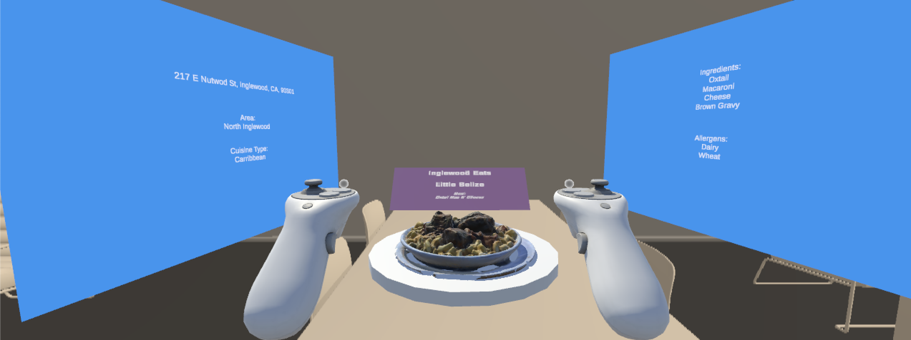

# InglewoodEats 🌮
 
An immersive Mixed Reality (MR) application designed to elevate and drive visibility for local, independent restaurants in the Inglewood area. 
 
**InglewoodEats** was developed and taught as part of **Google Code Next Inglewood (2026)** within the **Community Pathway**.

# Demo


# Tech Stack
| Technology | Version |
|-----------|---------|
| Unity | 6000.3.11f1 LTS |
| Blender | — |

## Getting Started
 
### Prerequisites
 
- [Unity](https://unity.com/download) 6000.3.11f1 LTS

### Installation
 
1. **Clone the repository:**
```bash
git clone https://github.com/raihanaza/inglewoodeats.git
cd inglewoodeats
```
 
2. Open Unity Hub, click **Open**, and select the project folder
3. Open the main scene and press **Play**

## Deploying to the Headset
 
1. Make sure you have **Android XR** downloaded in Unity
2. In Unity, go to **File → Build Settings**
3. Select **Android** as the target platform
4. Click **Build & Run** with your headset connected

## License
 
This project is licensed under the **MIT License** — see the [LICENSE](LICENSE) file for details.
 
